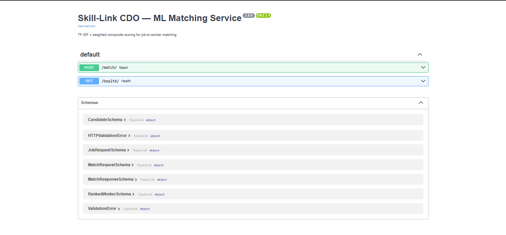

# Skill-Link CDO — FastAPI ML Matching Service

## Project Description

Skill-Link CDO is a machine learning-assisted, barangay-based skilled worker registry and matching system for Cagayan de Oro City, Philippines. This repository contains the standalone ML Matching Service — a FastAPI microservice that powers the worker-to-job matching engine. It receives a pre-filtered list of verified worker candidates and a job request from the Django backend, applies a weighted composite scoring model, and returns a ranked list of worker IDs ordered by match quality.

This service operates independently of the Django backend. It holds no database connection and persists no personal data. All processing is performed in-memory per request.

---

## Features

- **TF-IDF Text Matching:** Vectorizes the job request description against each candidate worker's bio using Term Frequency-Inverse Document Frequency (TF-IDF) and computes Cosine Similarity scores to determine skill relevance.
- **Geographic Proximity Scoring:** Computes the distance between the job site coordinates and each worker's registered address coordinates using the Haversine formula, normalized to a 0–1 proximity score.
- **Price Compatibility Scoring:** Compares the resident's preferred budget range against each worker's declared typical rate to produce a price compatibility score.
- **Rating Signal:** Incorporates the worker's cached average rating (`avg_rating`, 0–5 scale) as a performance quality signal.
- **Weighted Composite Scoring:** Combines the four signals using a configurable linear weighted model:
  - Text Relevance: **40%**
  - Geographic Proximity: **25%**
  - Price Compatibility: **20%**
  - Worker Rating: **15%**
- **API Key Authentication:** All requests must include a valid `X-Service-Key` header. Requests without a valid key receive HTTP 403 before any ML processing occurs.
- **Health Check Endpoint:** `GET /health/` returns `{ "status": "ok" }` for Render health checks and Django startup validation.
- **Configurable Weights:** Scoring weights are defined in `config.py` and can be updated without modifying application code.
- **Auto-generated API Documentation:** FastAPI exposes an OpenAPI specification at `/docs` (Swagger UI) and `/redoc`.

---

## Technology Stack

| Layer              | Technology                                   |
| ------------------ | -------------------------------------------- |
| Language           | Python 3.11+                                 |
| Web Framework      | FastAPI 0.110+                               |
| ASGI Server        | Uvicorn                                      |
| ML / Vectorization | Scikit-learn 1.x (TF-IDF, Cosine Similarity) |
| Data Processing    | Pandas 2.x                                   |
| Request Validation | Pydantic v2                                  |
| Environment Config | python-dotenv                                |
| Deployment         | Render (Web Service)                         |

---

## System Architecture

```
[Django REST API — skill-link-cdo-backend]
        │
        │  POST /match/
        │  Header: X-Service-Key: <shared_secret>
        │  Body: { job_request: {...}, candidates: [{...}] }
        │
        ▼
┌──────────────────────────────────────────┐
│        FastAPI ML Service (this repo)    │
│                                          │
│  1. Validate API key                     │
│  2. Validate payload (Pydantic)          │
│  3. TF-IDF vectorize description vs bios │
│  4. Haversine proximity scoring          │
│  5. Price compatibility scoring          │
│  6. Rating signal normalization          │
│  7. Weighted composite score assembly    │
│  8. Sort candidates by composite score   │
│                                          │
└──────────────────────────────────────────┘
        │
        │  HTTP 200
        │  Body: { ranked: [{ worker_id, score, score_breakdown }, ...] }
        │
        ▼
[Django REST API — returns matched workers to Resident]
```

The service holds no database connection. It does not store, log, or cache any personal data from request payloads.

---

## Repository Structure

```
skill-link-cdo-ml/
├── main.py                  # FastAPI app entry point; defines POST /match/ and GET /health/
├── matcher/
│   ├── engine.py            # Core matching logic: TF-IDF, Haversine, price, rating, composite score
│   └── schema.py            # Pydantic request and response models for the /match/ endpoint
├── config.py                # Scoring weight configuration (WEIGHT_TEXT, WEIGHT_PROXIMITY, etc.)
├── requirements.txt         # fastapi, uvicorn, scikit-learn, pandas, python-dotenv
├── .env                     # SERVICE_API_KEY (never committed to source control)
└── render.yaml              # Render Web Service deployment configuration
```

---

## API Contract

### `POST /match/`

Ranks a pre-filtered list of verified worker candidates against a job request.

**Request Headers**

| Header          | Value              |
| --------------- | ------------------ |
| `Content-Type`  | `application/json` |
| `X-Service-Key` | `<shared_secret>`  |

**Request Body**

```json
{
  "job_request": {
    "description": "Fix a leaking pipe under the kitchen sink",
    "budget_min": 300,
    "budget_max": 500,
    "location_lat": 8.4542,
    "location_lng": 124.6319
  },
  "candidates": [
    {
      "worker_id": "uuid-string",
      "declared_rate": 400,
      "avg_rating": 4.5,
      "address_lat": 8.4501,
      "address_lng": 124.628,
      "bio": "Experienced plumber specializing in pipe repair and installation."
    }
  ]
}
```

> **Note:** `category_id` is intentionally excluded from the payload. The Django API applies the skill category as a hard pre-filter before building this payload. The ML service operates only on the four scoring signals above.

**Response — Success (HTTP 200)**

```json
{
  "ranked": [
    {
      "worker_id": "uuid-string",
      "score": 0.82,
      "score_breakdown": {
        "text_score": 0.91,
        "proximity_score": 0.87,
        "price_score": 0.75,
        "rating_score": 0.9
      }
    }
  ]
}
```

**Response — Auth Failure (HTTP 403)**

```json
{ "detail": "Forbidden" }
```

**Response — Validation Error (HTTP 422)**

```json
{ "detail": [ { "loc": [...], "msg": "...", "type": "..." } ] }
```

### `GET /health/`

Returns `{ "status": "ok" }` with HTTP 200. Used by Render for deployment health checks.

---

## Scoring Model

| Signal               | Weight | Method                                                                            |
| -------------------- | ------ | --------------------------------------------------------------------------------- |
| Text Relevance       | 40%    | TF-IDF vectorization of job description vs. worker bio; Cosine Similarity         |
| Geographic Proximity | 25%    | Haversine formula; normalized to 0–1 (max distance = 50 km)                       |
| Price Compatibility  | 20%    | Overlap between resident budget range and worker declared rate; normalized to 0–1 |
| Worker Rating        | 15%    | Worker `avg_rating` (0–5) divided by 5; normalized to 0–1                         |

Weights are defined in `config.py` as `WEIGHT_TEXT`, `WEIGHT_PROXIMITY`, `WEIGHT_PRICE`, and `WEIGHT_RATING`. They can be adjusted without code changes to `engine.py` or `main.py`.

---

## Installation & Setup

### Prerequisites

- Python 3.11+
- pip

### Steps

```bash
# 1. Clone the repository
git clone https://github.com/Quenie-Ann/Skill-Link-Cdo-ML.git
cd skill-link-cdo-ml

# 2. Create and activate a virtual environment
python -m venv venv
source venv/bin/activate  # Windows: venv\Scripts\activate

# 3. Install dependencies
pip install -r requirements.txt

# 4. Configure environment variables
cp .env.example .env
# Edit .env and set:
# SERVICE_API_KEY=your-shared-secret-key

# 5. Start the development server
uvicorn main:app --reload --host 0.0.0.0 --port 8001
```

The ML service will be available at `http://localhost:8001`.
Swagger UI: `http://localhost:8001/docs`

### Environment Variables

| Variable          | Description                                                                                                                                                                   |
| ----------------- | ----------------------------------------------------------------------------------------------------------------------------------------------------------------------------- |
| `SERVICE_API_KEY` | Shared secret key for authenticating requests from the Django API. Must match `ML_SERVICE_API_KEY` in the Django backend's `.env`. Never commit this value to source control. |
| `PORT`            | Port number (set automatically by Render in production).                                                                                                                      |

---

## Deployment Link

**Live ML Service Base URL:** `https://skill-link-cdo-ml.onrender.com/`
**Health Check:** `https://skill-link-cdo-ml.onrender.com/health/`
**Swagger UI:** `https://skill-link-cdo-ml.onrender.com/docs`

---

## Team Members and Roles

| Name                     | Role |
| ------------------------ | ---- |
| [Abragan, Quenie Ann H.] |
| [Tubio, Johnlie P.]      |
| [Gaccion, Tirso Louise]  |

---

## Known Limitations

- **Cold-start latency.** On Render's free tier, the service hibernates after a period of inactivity. The first request after a cold start may take up to 30 seconds, which will exceed the Django API's 10-second timeout and return a 503 to the client. This is mitigated by a scheduled health-check ping from the Django API every 10 minutes during active hours.
- **Small corpus TF-IDF performance.** In the early pilot phase, the TF-IDF corpus (worker bios) is small and may not provide sufficient vocabulary diversity for meaningful text differentiation between candidates. The composite scoring model compensates by weighting proximity and rating signals. A fallback ranking by `avg_rating` and proximity is applied when the text relevance signal falls below a defined threshold.
- **No model persistence.** The TF-IDF vectorizer is fitted fresh on each request against the candidate bios provided in the payload. This is intentional — it eliminates stale model state — but means the vectorizer does not benefit from cross-request vocabulary learning. A pre-trained corpus vectorizer is planned for a future iteration.
- **Synchronous blocking.** The current matching pipeline is synchronous. The Django backend blocks until this service responds. This is appropriate for the pilot scope (≤50 concurrent users) and will be replaced with an asynchronous Celery task queue for city-wide deployment.
- **No data persistence.** By design, the service retains no data from request payloads. This satisfies RA 10173 data minimization requirements but means no request history is available for model evaluation within this service.

---

## Screenshots


